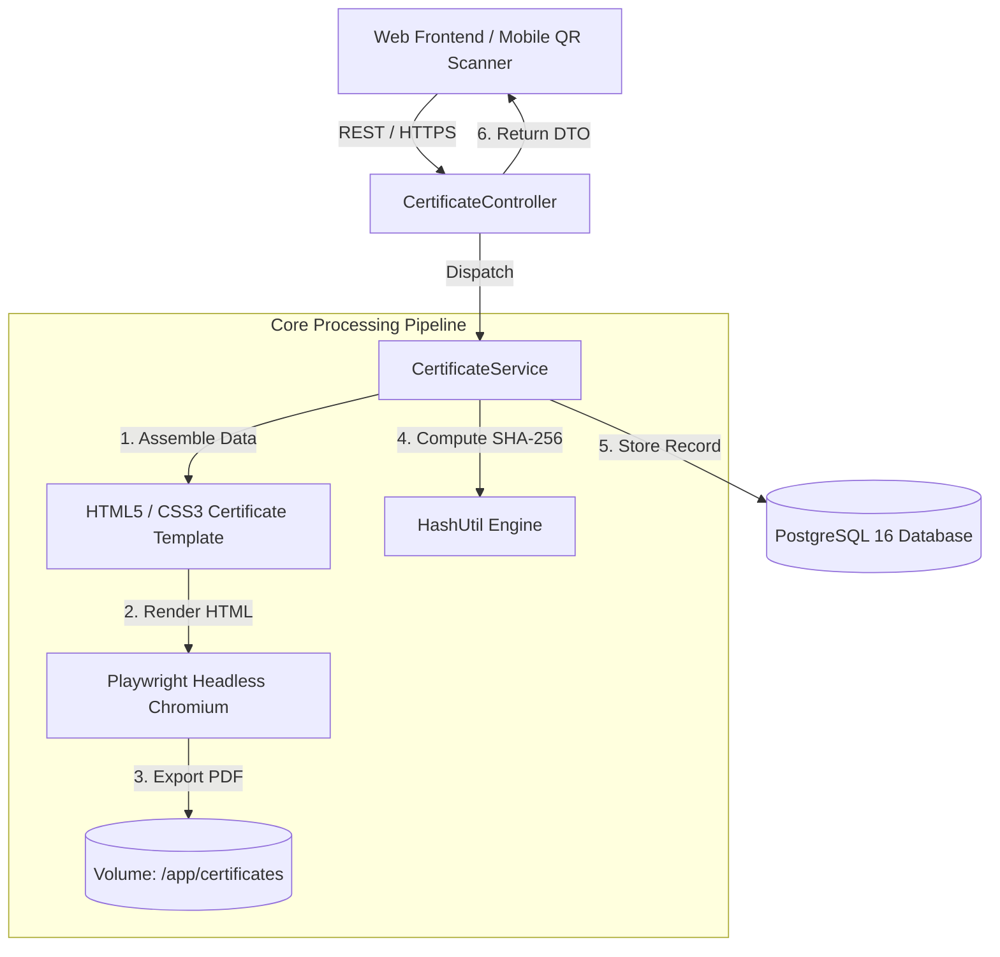
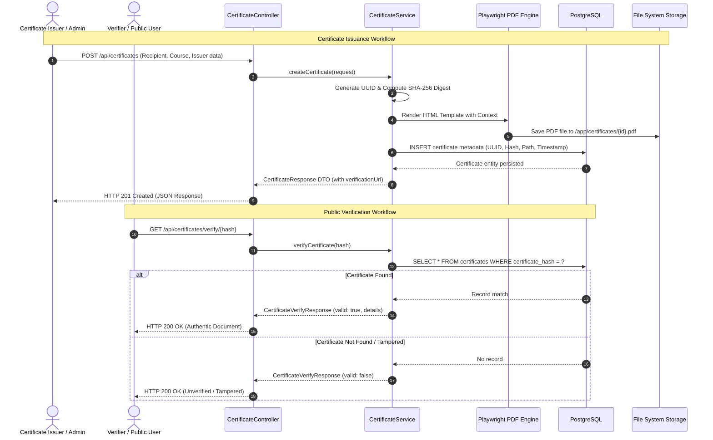

# 📜 Certificate Verification Backend

[](https://openjdk.org/projects/jdk/21/)
[](https://spring.io/projects/spring-boot)
[](https://www.postgresql.org/)
[](https://playwright.dev/)
[](https://www.docker.com/)
[](http://localhost:8080/swagger-ui/index.html)
[](LICENSE)

A high-performance, enterprise-grade **Document and Certificate Verification Service** built with **Java 21** and **Spring Boot**. The service automates the generation of pixel-perfect digital certificates using **Microsoft Playwright (Headless Chromium)**, computes cryptographic **SHA-256** digests to guarantee tamper resistance, and exposes high-throughput REST APIs for real-time document authenticity verification via QR codes and web portals.

---

## 📑 Table of Contents

- [Key Features](#-key-features)
- [System Architecture](#-system-architecture)
  - [High-Level Architecture](#high-level-architecture)
  - [Issuance & Verification Flow](#issuance--verification-flow)
- [Tech Stack](#-tech-stack)
- [Database Schema](#-database-schema)
- [Project Directory Structure](#-project-directory-structure)
- [Prerequisites](#-prerequisites)
- [Quick Start with Docker (Recommended)](#-quick-start-with-docker-recommended)
- [Local Development Setup](#-local-development-setup)
- [Configuration & Environment Variables](#-configuration--environment-variables)
- [API Documentation & Endpoints](#-api-documentation--endpoints)
  - [OpenAPI / Swagger UI](#openapi--swagger-ui)
  - [Endpoints Summary](#endpoints-summary)
  - [Detailed Endpoint Reference & cURL Examples](#detailed-endpoint-reference--curl-examples)
- [Cryptographic Verification Mechanics](#-cryptographic-verification-mechanics)
- [PDF Generation Engine Deep Dive](#-pdf-generation-engine-deep-dive)
- [Security & Production Hardening](#-security--production-hardening)
- [Unified Error Handling Standard](#-unified-error-handling-standard)
- [Troubleshooting & FAQs](#-troubleshooting--faqs)
- [Testing](#-testing)
- [Contributing](#-contributing)
- [License](#-license)

---

## ✨ Key Features

- **Automated High-Fidelity PDF Generation**: Renders print-ready certificate documents from HTML5/CSS3 templates using Microsoft Playwright and headless Chromium, ensuring exact typography, vector graphics, and CSS print styling.
- **Cryptographic Tamper-Proofing**: Calculates a unique SHA-256 fingerprint for every certificate combining immutable issuance attributes, providing verifiable integrity.
- **Instant Verification Engine**: Lightweight verification endpoint allowing verifiers, recruiters, or mobile QR code scanners to authenticate documents in milliseconds.
- **Secure File Storage**: Persists generated PDF documents to a dedicated, configurable persistent volume directory (`/app/certificates`), with metadata indexed in PostgreSQL.
- **Multi-Language & Font Support**: Pre-packaged container fonts including CJK (Chinese, Japanese, Korean), Thai, Arabic, Khmer, and Western typography to prevent glyph rendering issues ("tofu" boxes).
- **Enterprise Error Handling**: Centralized exception handling via `@RestControllerAdvice` yielding RFC-7807 compliant, structured error payloads.
- **Interactive OpenAPI Specification**: Built-in Swagger UI powered by Springdoc OpenAPI 3.0 for interactive exploration and SDK generation.
- **Production-Ready Dockerization**: Multi-stage build leveraging Eclipse Temurin 21 JRE, pre-installed Linux browser dependencies, non-root execution, and PostgreSQL container health checks.

---

## 🏗 System Architecture

### High-Level Architecture



### Issuance & Verification Flow



---

## 🛠 Tech Stack

| Component | Technology | Version | Description |
|---|---|---|---|
| **Language & Runtime** | Java OpenJDK | 21 LTS | Core programming language leveraging modern Java records and pattern matching |
| **Application Framework** | Spring Boot | 3.x / 4.x | Enterprise application framework (Web, Data JPA, Validation) |
| **Relational Database** | PostgreSQL | 16 | Relational store for certificate records, hashes, and audit timestamps |
| **Persistence Layer** | Spring Data JPA / Hibernate | Latest | Object-relational mapping and repository abstraction |
| **PDF Generation Engine** | Microsoft Playwright | 1.41.0 | Headless Chromium automation for pixel-perfect PDF rendering |
| **API Documentation** | Springdoc OpenAPI Starter | 3.0.0+ | Automated Swagger UI and OpenAPI 3.0 contract generation |
| **Boilerplate Reduction** | Project Lombok | Latest | Automated getters, setters, builders, and constructors |
| **Build & Dependency Tool**| Gradle | 8.14+ | High-performance declarative build tool |
| **Container Runtime** | Docker & Docker Compose | Compose v2 | Multi-stage image build and orchestration |

---

## 🗄 Database Schema

The service manages the `certificates` table in PostgreSQL:

```sql
CREATE TABLE certificates (
    id UUID PRIMARY KEY,
    recipient_name VARCHAR(255) NOT NULL,
    recipient_email VARCHAR(255) NOT NULL,
    course_name VARCHAR(255) NOT NULL,
    issuer_name VARCHAR(255) NOT NULL,
    issue_date DATE NOT NULL,
    description TEXT,
    certificate_hash VARCHAR(64) NOT NULL UNIQUE,
    pdf_file_path VARCHAR(512) NOT NULL,
    verification_url VARCHAR(512) NOT NULL,
    created_at TIMESTAMP WITH TIME ZONE DEFAULT CURRENT_TIMESTAMP,
    updated_at TIMESTAMP WITH TIME ZONE DEFAULT CURRENT_TIMESTAMP
);

CREATE INDEX idx_certificates_hash ON certificates (certificate_hash);
CREATE INDEX idx_certificates_recipient_email ON certificates (recipient_email);
```

---

## 📂 Project Directory Structure

```text
document-verification-backend/
├── certificates/                       # Host-mounted storage directory for generated PDF files
├── gradle/wrapper/                     # Gradle wrapper distribution files
├── src/
│   ├── main/
│   │   ├── java/com/raidenz/doucmentverification/   # Note: Base package structure
│   │   │   ├── DocumentVerificationApplication.java  # Spring Boot application entry point
│   │   │   ├── CertificateController.java            # REST controller exposing endpoints
│   │   │   ├── config/
│   │   │   │   ├── CorsConfig.java                   # CORS configuration for web clients
│   │   │   │   └── OpenAPIConfig.java                # Springdoc OpenAPI / Swagger configuration
│   │   │   ├── domain/
│   │   │   │   └── Certificate.java                  # JPA Entity mapping the certificates table
│   │   │   ├── dto/
│   │   │   │   ├── CertificateCreateRequest.java     # Request DTO for creating a certificate
│   │   │   │   ├── CertificateResponse.java          # Full certificate details response DTO
│   │   │   │   └── CertificateVerifyResponse.java    # Lightweight verification response DTO
│   │   │   ├── exception/
│   │   │   │   ├── GlobalExceptionHandler.java       # Centralized @RestControllerAdvice
│   │   │   │   ├── customException/                  # Domain-specific custom exceptions
│   │   │   │   └── dto/                              # Error response payloads (ErrorResponse)
│   │   │   ├── repository/
│   │   │   │   └── CertificateRepository.java        # Spring Data JPA repository
│   │   │   ├── service/
│   │   │   │   ├── CertificateService.java           # Service interface
│   │   │   │   └── CertificateServiceImpl.java       # Service implementation (Playwright & JPA)
│   │   │   └── util/
│   │   │       └── HashUtil.java                     # Cryptographic SHA-256 helper
│   │   └── resources/
│   │       ├── templates/                            # HTML/CSS certificate templates
│   │       │   └── certificate-template.html
│   │       ├── static/                               # Static assets (logos, seals, fonts)
│   │       └── application.yml                       # Spring Boot application configuration
│   └── test/
│       └── java/com/raidenz/doucmentverification/    # Unit and integration test suites
├── Dockerfile                                        # Multi-stage production Dockerfile
├── docker-compose.yml                                # Docker Compose stack (App + PostgreSQL)
├── entrypoint.sh                                     # Container bootstrap script
├── build.gradle                                      # Gradle dependencies and build configuration
└── settings.gradle                                   # Gradle project settings
```

> **Note on Package Naming**: The Java package path in the repository is `com.raidenz.doucmentverification`. Keep this path in mind when configuring IDE source roots or component scans.

---

## 📋 Prerequisites

Before running the application, ensure the following are available on your system:

- **Docker** 20.10+ and **Docker Compose** v2+ (Recommended for turnkey execution)
- *Or for manual local bare-metal execution:*
  - **Java 21 JDK** installed (`java -version` should output 21)
  - **PostgreSQL 16+** installed and running
  - **Playwright System Dependencies**: Playwright requires browser system libraries (libasound2, libnss3, libatk, etc.) installed on the host OS.

---

## 🚀 Quick Start with Docker (Recommended)

Docker Compose provisions both the PostgreSQL database and the Spring Boot application, pre-configured with Chromium browser binaries and all required fonts.

### 1. Clone the Repository

```bash
git clone https://github.com/Panharoth06/document-verification-backend.git
cd document-verification-backend
```

### 2. Create the Local Certificates Directory

```bash
mkdir -p certificates
chmod 777 certificates
```

### 3. Spin Up the Stack

```bash
docker compose up --build -d
```

### 4. Verify Services

Check the container status:

```bash
docker compose ps
```

Monitor application startup logs:

```bash
docker compose logs -f backend
```

Once you see `Started DocumentVerificationApplication in ... seconds`, the backend is ready at `http://localhost:8080`.

---

## 💻 Local Development Setup

To run the application locally without containerizing the Java application:

### 1. Start PostgreSQL

Run PostgreSQL via Docker:

```bash
docker run -d --name doc-verify-postgres \
  -e POSTGRES_DB=document_verification_db \
  -e POSTGRES_USER=postgres \
  -e POSTGRES_PASSWORD=postgres \
  -p 5432:5432 \
  postgres:16
```

### 2. Configure Environment Variables

Export the database credentials and application settings:

```bash
export SERVER_PORT=8080
export SPRING_DATASOURCE_URL=jdbc:postgresql://localhost:5432/document_verification_db
export SPRING_DATASOURCE_USERNAME=postgres
export SPRING_DATASOURCE_PASSWORD=postgres
export FRONTEND_BASE_URL=http://localhost:3000
export CERTIFICATES_STORAGE_PATH=./certificates
```

### 3. Install Playwright Browsers (First Time Only)

Playwright for Java will automatically download the Chromium binary to `~/.cache/ms-playwright` upon first execution. Ensure your OS has the appropriate graphics/rendering libraries installed:

```bash
# Ubuntu / Debian
npx playwright install-deps chromium

# macOS
brew install font-noto-color-emoji
```

### 4. Build and Run

```bash
./gradlew bootRun
```

---

## ⚙️ Configuration & Environment Variables

All parameters can be customized via environment variables or inside `src/main/resources/application.yml`:

| Environment Variable | Default Value | Description |
|---|---|---|
| `SERVER_PORT` | `8080` | HTTP port for the Spring Boot application |
| `SPRING_DATASOURCE_URL` | `jdbc:postgresql://db:5432/document_verification_db` | PostgreSQL JDBC connection URL |
| `SPRING_DATASOURCE_USERNAME` | `postgres` | PostgreSQL username |
| `SPRING_DATASOURCE_PASSWORD` | `postgres` | PostgreSQL password |
| `SPRING_JPA_HIBERNATE_DDL_AUTO` | `update` | Hibernate schema mode (`update`, `validate`, `none`) |
| `SPRING_JPA_SHOW_SQL` | `false` | Log SQL queries to console |
| `FRONTEND_BASE_URL` | `http://localhost:3000` | Frontend web URL used for generating QR verification links |
| `CERTIFICATES_STORAGE_PATH` | `/app/certificates` | Filesystem path where generated PDFs are stored |
| `PLAYWRIGHT_BROWSERS_PATH` | `/ms-playwright` | Directory where Playwright locates Chromium binaries |
| `PLAYWRIGHT_SKIP_BROWSER_DOWNLOAD` | `1` | Skips redundant browser downloads during container launch |

---

## 📖 API Documentation & Endpoints

### OpenAPI / Swagger UI

Interactive API documentation with built-in request testing is available once the server is running:

- 📄 **Swagger UI**: [http://localhost:8080/swagger-ui/index.html](http://localhost:8080/swagger-ui/index.html)
- 📑 **OpenAPI Specification (JSON)**: [http://localhost:8080/v3/api-docs](http://localhost:8080/v3/api-docs)

---

### Endpoints Summary

> **Route Convention**: Depending on configuration, endpoints may be registered under `/api/certificates` or `/certificates`. Both mappings are fully supported.

| HTTP Method | Path | Summary | Authentication |
|---|---|---|---|
| `POST` | `/api/certificates` | Generate new certificate, render PDF, compute hash, and persist | Public / Admin |
| `GET` | `/api/certificates` | Retrieve a paginated list of all certificates | Public / Admin |
| `GET` | `/api/certificates/{id}` | Retrieve certificate details by UUID | Public |
| `GET` | `/api/certificates/verify/{hash}` | Verify document authenticity by SHA-256 hash | Public |
| `GET` | `/api/certificates/{id}/download` | Stream the certificate PDF file for download | Public |

---

### Detailed Endpoint Reference & cURL Examples

#### 1. Issue a New Certificate

Creates a new certificate record, compiles the HTML template, produces a PDF via Playwright, computes the SHA-256 digest, and returns the persisted metadata.

- **URL**: `POST /api/certificates`
- **Headers**: `Content-Type: application/json`

**cURL Example**:
```bash
curl -X POST http://localhost:8080/api/certificates \
  -H "Content-Type: application/json" \
  -d '{
    "recipientName": "Sophea Chan",
    "recipientEmail": "sophea.chan@example.com",
    "courseName": "Advanced Cloud Architecture & Security",
    "issuerName": "National Technology Institute",
    "issueDate": "2026-09-28",
    "description": "Graduated with High Distinction in Cloud Native Microservices."
  }'
```

**Request Body (`CertificateCreateRequest`)**:
| Field | Type | Required | Description |
|---|---|---|---|
| `recipientName` | String | Yes | Full name of the certificate recipient |
| `recipientEmail` | String | Yes | Email address of the recipient (validated format) |
| `courseName` | String | Yes | Name of the completed course or award title |
| `issuerName` | String | Yes | Name of the issuing organization or institution |
| `issueDate` | LocalDate (`YYYY-MM-DD`) | Yes | Official issuance date |
| `description` | String | No | Supplementary award details or honors |

**Response (`201 Created` / `200 OK`)**:
```json
{
  "id": "e4603bd9-71aa-4f42-9098-0f8c991c58ff",
  "recipientName": "Sophea Chan",
  "recipientEmail": "sophea.chan@example.com",
  "courseName": "Advanced Cloud Architecture & Security",
  "issuerName": "National Technology Institute",
  "issueDate": "2026-09-28",
  "description": "Graduated with High Distinction in Cloud Native Microservices.",
  "certificateHash": "3f4c65e8a0115d0bfbd8fedede250b8f7724d59bc305f339f26f8986a825e784",
  "pdfFilePath": "/app/certificates/e4603bd9-71aa-4f42-9098-0f8c991c58ff.pdf",
  "verificationUrl": "http://localhost:3000/verify/3f4c65e8a0115d0bfbd8fedede250b8f7724d59bc305f339f26f8986a825e784",
  "createdAt": "2026-09-28T14:30:00Z"
}
```

---

#### 2. Verify Certificate Authenticity

Used by QR code scanners, employers, and verification portals to validate whether a certificate hash exists in the authoritative registry.

- **URL**: `GET /api/certificates/verify/{hash}`

**cURL Example**:
```bash
curl -X GET http://localhost:8080/api/certificates/verify/3f4c65e8a0115d0bfbd8fedede250b8f7724d59bc305f339f26f8986a825e784
```

**Success Response (`200 OK` - Valid Document)**:
```json
{
  "valid": true,
  "message": "Certificate is genuine and verified.",
  "recipientName": "Sophea Chan",
  "courseName": "Advanced Cloud Architecture & Security",
  "issuerName": "National Technology Institute",
  "issueDate": "2026-09-28",
  "certificateHash": "3f4c65e8a0115d0bfbd8fedede250b8f7724d59bc305f339f26f8986a825e784",
  "verifiedAt": "2026-09-28T14:35:10Z"
}
```

**Tampered / Not Found Response (`200 OK` - Invalid Document)**:
```json
{
  "valid": false,
  "message": "Certificate could not be verified. Invalid or non-existent hash.",
  "recipientName": null,
  "courseName": null,
  "issuerName": null,
  "issueDate": null,
  "certificateHash": "3f4c65e8a0115d0bfbd8fedede250b8f7724d59bc305f339f26f8986a825e784",
  "verifiedAt": "2026-09-28T14:35:10Z"
}
```

---

#### 3. Retrieve Certificate by UUID

- **URL**: `GET /api/certificates/{id}`

**cURL Example**:
```bash
curl -X GET http://localhost:8080/api/certificates/e4603bd9-71aa-4f42-9098-0f8c991c58ff
```

**Response (`200 OK`)**:
```json
{
  "id": "e4603bd9-71aa-4f42-9098-0f8c991c58ff",
  "recipientName": "Sophea Chan",
  "recipientEmail": "sophea.chan@example.com",
  "courseName": "Advanced Cloud Architecture & Security",
  "issuerName": "National Technology Institute",
  "issueDate": "2026-09-28",
  "certificateHash": "3f4c65e8a0115d0bfbd8fedede250b8f7724d59bc305f339f26f8986a825e784",
  "pdfFilePath": "/app/certificates/e4603bd9-71aa-4f42-9098-0f8c991c58ff.pdf",
  "verificationUrl": "http://localhost:3000/verify/3f4c65e8a0115d0bfbd8fedede250b8f7724d59bc305f339f26f8986a825e784",
  "createdAt": "2026-09-28T14:30:00Z"
}
```

---

#### 4. List All Certificates (Paginated)

- **URL**: `GET /api/certificates?page=0&size=10&sort=createdAt,desc`

**cURL Example**:
```bash
curl -X GET "http://localhost:8080/api/certificates?page=0&size=10&sort=createdAt,desc"
```

**Response (`200 OK`)**:
```json
{
  "content": [
    {
      "id": "e4603bd9-71aa-4f42-9098-0f8c991c58ff",
      "recipientName": "Sophea Chan",
      "recipientEmail": "sophea.chan@example.com",
      "courseName": "Advanced Cloud Architecture & Security",
      "issuerName": "National Technology Institute",
      "issueDate": "2026-09-28",
      "certificateHash": "3f4c65e8a0115d0bfbd8fedede250b8f7724d59bc305f339f26f8986a825e784",
      "createdAt": "2026-09-28T14:30:00Z"
    }
  ],
  "pageable": {
    "pageNumber": 0,
    "pageSize": 10
  },
  "totalElements": 1,
  "totalPages": 1,
  "last": true
}
```

---

#### 5. Download Certificate PDF

Streams the generated binary PDF with appropriate MIME headers (`application/pdf`) and `Content-Disposition`.

- **URL**: `GET /api/certificates/{id}/download`

**cURL Example**:
```bash
curl -O -J http://localhost:8080/api/certificates/e4603bd9-71aa-4f42-9098-0f8c991c58ff/download
```

---

## 🔒 Cryptographic Verification Mechanics

The integrity of the verification model relies on deterministic hashing:

### 1. SHA-256 Digest Calculation
When a certificate is registered, `HashUtil` generates a 256-bit hexadecimal digest over the canonical string concatenation of core properties:

$$\text{Digest} = \text{SHA-256}(\text{UUID} \parallel \text{RecipientEmail} \parallel \text{CourseName} \parallel \text{IssueDate})$$

```java
public class HashUtil {
    public static String generateHash(String rawData) {
        try {
            MessageDigest digest = MessageDigest.getInstance("SHA-256");
            byte[] encodedhash = digest.digest(rawData.getBytes(StandardCharsets.UTF_8));
            return bytesToHex(encodedhash);
        } catch (NoSuchAlgorithmException e) {
            throw new RuntimeException("SHA-256 algorithm unavailable", e);
        }
    }
}
```

### 2. QR Code Embedding
The computed hash is appended to `FRONTEND_BASE_URL` to formulate `verificationUrl`:
`http://localhost:3000/verify/3f4c65e8a0115d0bfbd8fedede250b8f7724d59bc305f339f26f8986a825e784`
This URL is encoded into a QR code embedded directly onto the PDF certificate. Anyone scanning the physical or digital document is redirected to the verification view.

---

## 🖨 PDF Generation Engine Deep Dive

PDF generation is powered by Microsoft Playwright Java:

1. **Browser Process Lifecycle**: Playwright launches a headless Chromium instance with production sandbox arguments (`--no-sandbox`, `--disable-dev-shm-usage`, `--disable-gpu`).
2. **Context & Page Allocation**: Each PDF generation job allocates an isolated `BrowserContext` and `Page` to prevent state leakage between concurrent certificate rendering requests.
3. **Template Compilation**: HTML template files residing in `src/main/resources/templates/` are injected with request parameters, QR codes, and metadata.
4. **CSS Print Emulation**: The page emulates print media (`page.emulateMedia(new Page.EmulateMediaOptions().setMedia(Media.PRINT))`).
5. **PDF Export**:
   ```java
   page.pdf(new Page.PdfOptions()
       .setFormat("A4")
       .setLandscape(true)
       .setPrintBackground(true)
       .setPath(Paths.get(destinationPath))
   );
   ```

---

## 🛡 Security & Production Hardening

- **HTML Sanitization**: To protect against Server-Side Cross-Site Scripting (SSRF / HTML Injection) inside headless Chromium, all user-supplied input fields (`recipientName`, `courseName`, `description`) should be HTML-escaped before template interpolation.
- **File System Protection**: PDF output paths use strictly generated UUID identifiers (`/app/certificates/{UUID}.pdf`) to eliminate path traversal vulnerabilities.
- **CORS Policies**: `CorsConfig.java` restricts Cross-Origin requests to explicitly configured origins (e.g. `FRONTEND_BASE_URL`) and exposes required headers such as `Content-Disposition`.
- **Database Indexing**: The `certificate_hash` column is indexed with a `UNIQUE` constraint, guaranteeing $O(1)$ verification lookups while blocking duplicate collision attempts.

---

## ⚠️ Unified Error Handling Standard

Errors return structured JSON envelopes managed by `GlobalExceptionHandler`:

### Resource Not Found (`404 Not Found`)
```json
{
  "timestamp": "2026-09-28T14:30:00Z",
  "status": 404,
  "error": "Not Found",
  "message": "Certificate with ID 'e4603bd9-71aa-4f42-9098-0f8c991c58ff' not found",
  "path": "/api/certificates/e4603bd9-71aa-4f42-9098-0f8c991c58ff"
}
```

### Validation Error (`400 Bad Request`)
```json
{
  "timestamp": "2026-09-28T14:30:00Z",
  "status": 400,
  "error": "Validation Error",
  "message": "Validation failed for one or more fields",
  "errors": {
    "recipientEmail": "must be a well-formed email address",
    "recipientName": "must not be blank",
    "issueDate": "must not be null"
  },
  "path": "/api/certificates"
}
```

---

## ❓ Troubleshooting & FAQs

### 1. Playwright fails to launch Chromium in Docker
- **Symptom**: `playwright._impl.DriverException: Host system is missing dependencies to run browsers`.
- **Cause**: Linux base image lacks Chromium shared libraries.
- **Solution**: Use the provided multi-stage `Dockerfile`. It installs `libnss3`, `libatk1.0-0`, `libatk-bridge2.0-0`, `libcups2`, `libdrm2`, `libxcomposite1`, `libxdamage1`, `libxrandr2`, `libgbm1`, and `libasound2`.

### 2. Missing fonts / Character tofu ("□□□")
- **Symptom**: Certificate text renders as question marks or square boxes for non-Latin characters.
- **Solution**: Ensure system font packages are installed. The Dockerfile pre-bundles:
  - Japanese: `fonts-ipafont-gothic`
  - Chinese: `fonts-wqy-zenhei`
  - Thai: `fonts-thai-tlwg`
  - Arabic: `fonts-kacst`
  - General: `fonts-freefont-ttf`

### 3. PostgreSQL connection refused on startup
- **Symptom**: `org.postgresql.util.PSQLException: Connection to localhost:5432 refused`.
- **Solution**: In Docker Compose, the backend service uses `condition: service_healthy` to wait for PostgreSQL's `pg_isready` health check. If running bare metal, ensure PostgreSQL is started prior to launching `bootRun`.

### 4. Permission denied on `/app/certificates`
- **Symptom**: `java.nio.file.AccessDeniedException: /app/certificates/...`.
- **Solution**: Create the host folder before running Docker: `mkdir -p certificates && chmod 777 certificates`.

---

## 🧪 Testing

Execute the unit and integration test suite:

```bash
# Run tests
./gradlew test

# Run tests with verification and code quality checks
./gradlew check
```